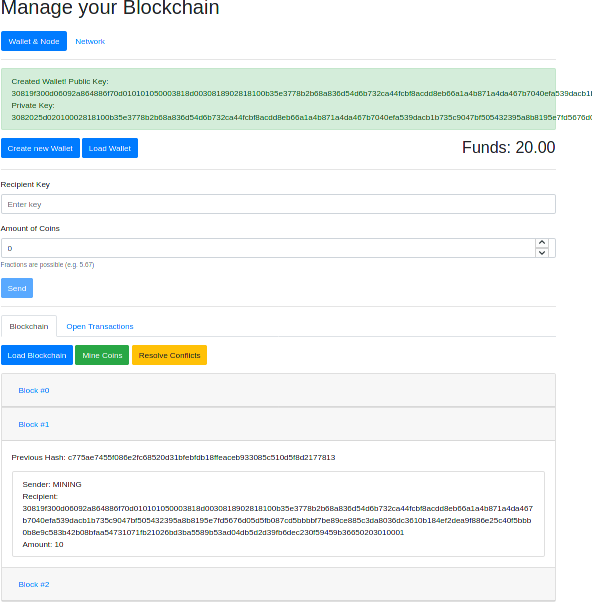
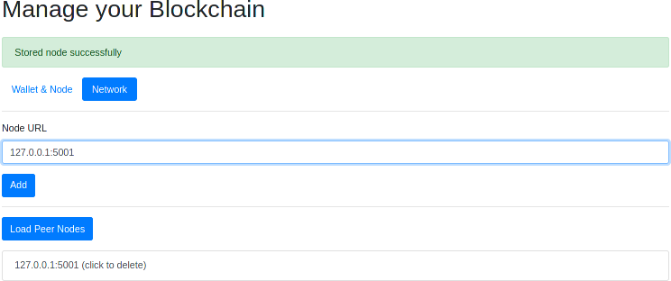

# Simple Blockchain
This project is an attempt to implement a basic blockchain.

## Table of contents
* [General info](#general-info)
* [Screenshots](#screenshots)
* [Technologies](#technologies)
* [Setup](#setup)
* [Features](#features)
* [Launch](#launch)
* [Code Example](#code-example)
* [Status](#status)
* [Inspiration and Sources](#inspiration-and-sources)
* [Contact](#contact)

## General info
This project is for training purpose, it is not aimed to implement something for production.
Further personnal improvements will be added in the future, all of them for training purpose.
I coded this blockchain to learn the technology and to solidify my knowledge in Python via online courses which this project is based on. You can see a documentation about the project in the pdf named [Documentation_Simple_Blockchain](https://github.com/flavienChamay/blockChainProject/blob/master/Documentation_Simple_Blockchain.pdf).

## Screenshots



## Technologies
* HTML - version 5
* Python - version 3.8.5
* flask - version 1.1.2
* flask-cors - version 3.0.9
* pycryptodome - version 3.9.9

## Setup
This project has been only tested on Linux Manjaro Nibia 20.2.1 and with Firefox 85.0 (64 bits).

### On Linux:
Install dependencies with pip3 (like flsak, flask-cors and pycryptodome):
```bash
pip3 install <name_of_dependency>
```
For Python and HTML, they should be installed on your Linux machine by default.

### On Windows:
No tests have been launched on Windows for the moment.

## Features
* Chain of data
* Mining of new blocks 
* Hasing a block
* Analyse and verify the chain
* Transactions mechanisms
* Store chain on disk
* Node network
* Wallets on text files

To-do list:
* Share data, resolve conflicts with consensus
* Desktop frontend with PyQt
* Replace Flask with Django

## Launch
After all dependencies has been installed, launch the project with a terminal on the source folder and type:
```bash
python node.py -p <port_number_of_wallet>
```
Without the `-p` option it will launch a wallet with the default port 5000.
You can launch as many wallet as you want on separate terminals.

## Code Example
On a first terminal, launch a wallet of port number 5000:
```bash
python node.py
```
Without closing the first terminal, open a second terminal and launch a wallet of port number 5001:
```bash
python node.py -p 5001
```
The URL of each wallet should appear on each terminal and can be copied on a tab of your browser.
In our example, on your browser (Firefox or Chrome) in one tab, write the url `127.0.0.1:5000`
it will show your first wallet and on another tab write `127.0.0.1:5001` it will show your second wallet.
From now, create a new wallet for each tab (by clicking on the blue button Create new Wallet), load the wallet (by clicking on the blue button Load Wallet), you can mine a block (by clicking on the green button Mine Coins), send a transaction to a recipient with the public key of the other wallet (in Recipient Key) and click the Send blue button to send.

## Status
This project is _in progress_ because documentation is missing, other functionnalities and polishing.

## Inspiration and Sources
Project based on tutorials of [Maximilian Schwarzmuller](https://github.com/maxschwarzmueller) from Academind 

## Contact
Written by [Flavien Chamay](mailto:flavien.chamay@protonmail.com) (thanks to Maximilian)
